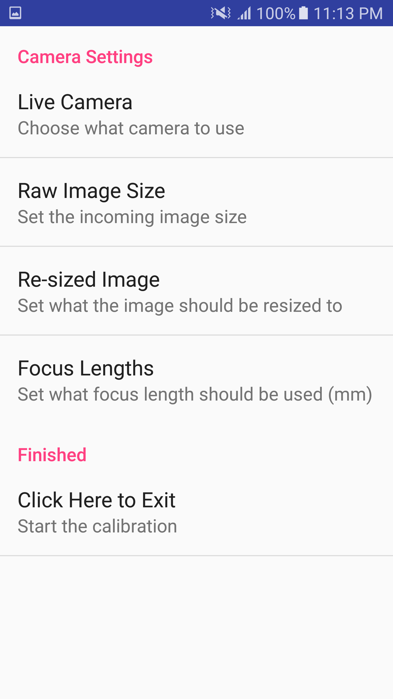
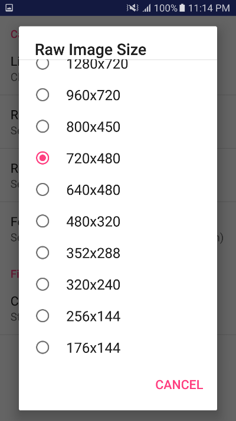

# Android Dataset Recorder

This android app allow for recording of datasets directly on a mobile device. This was made to allow for offline processing of data to verify different algorithms before they would be directly implemented on the phone. For each recording the images and IMU data will be put on the external SD card which allows for easy transfer of datasets.

To open this project, just load up android studio, and go `File > Open...`. Select this repository folder (not a sub-folder in this repository) and the project should automatically open and download all needed sdk and libraries. It doesn't really rely on anything large, just the normal libraries from google.

## Features

* Record images in jpeg format into a custom folder
* Records IMU data at the same time the images are recorded
* Custom selection of what camera to use
* TODO: Select what rate of IMU to use
* TODO: Add gps recording
* TODO: Look into timestamps to make sure everything is ok

## Layout

The main application is located in the `/app/` folder and has its own gradle.build. This file instructs the gradle build system how to make this project and what libraries it depends on.

For the actual program there are 2 activities. The main on has the camera view. On launch this one is created, and instantly launches the settings activity. This is a `PreferenceActivity` hands off the view and settings loading to the android api. This is really nice since after each setting is edited the "shared preference" for this application gets updated. The actual main activity has the camera render, and the record button. To stop the recording the button can be pressed again.

## Screenshots

